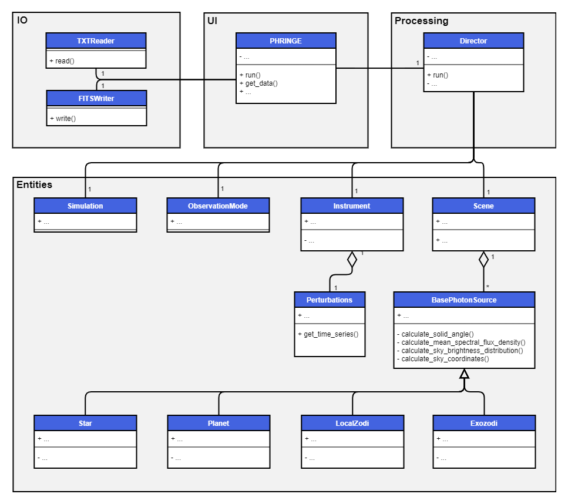

.. _architecture:

Architecture
============

Class Diagram
-------------

The simplified class diagram of PHRINGE shown below gives an overview of the software architecture. The key components
are a **user interface (UI)**, a **processing** component, an **input/output (IO)** component and the **entities**.

Components
----------

UI
~~
The UI contains the :ref:`PHRINGE <class.phringe>` class, which serves as an interface to let the user configure the simulation and retrieve the results thereof.

Processing
~~~~~~~~~~
The processing component contains the :ref:`Director <class.director>`, which is responsible for coordinating the simulation.
This includes the following steps:

* Calculate the symbolic instrument response.
* Calculate the simulation time steps.
* Calculate the field of view of the observatory.
* Calculate the nulling baseline.
* Calculate the instrument perturbation time series, if applicable.
* Calculate the spectral flux density, brightness distributions and coordinates of all sources in the scene.
* Calculate the differential counts using the intensity response and the sources in the scene.

IO
~~

The IO component contains the ``TXTReader`` and ``FITSWriter``classes to read text and write FITS files.

Entities
~~~~~~~~
The entities are the classes that represent the objects in the simulation. The main objects are the :ref:`Simulation <class.simulation>`, :ref:`ObservationMode <class.observation_mode>`, :ref:`Instrument <class.instrument>` and :ref:`Scene <class.scene>` classes.