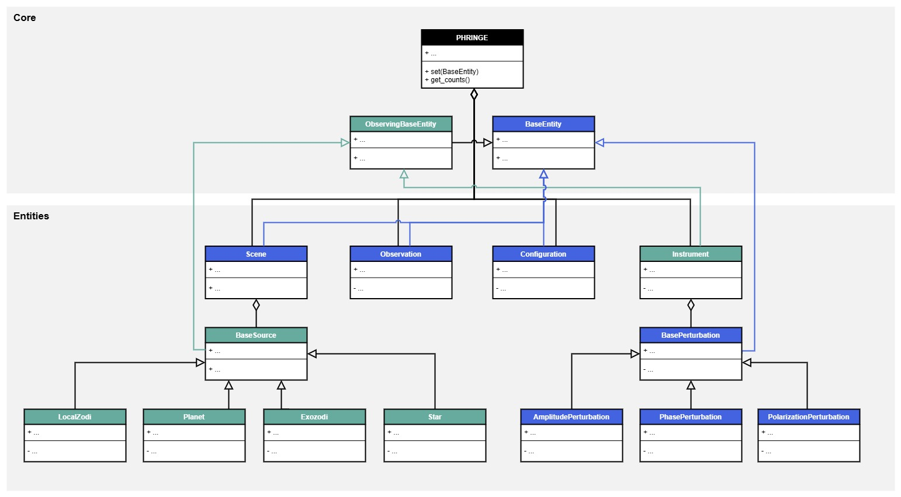

.. _architecture:

Architecture
============

Overview
--------

A key feature of `PHRINGE` is its interactive user interface, meaning e.g. instrument parameters can be updated on-the-fly and the corresponding data
regenerated, without having to run the whole initialization process again. This requires the consideration of two main issues:

1. **Dependency Management**: The objects in the simulation are interdependent, meaning that changes to one object can affect the properties of other objects. For example, changing the spectral resolving power of the ``Instrument`` will affect the spectral energy distribution of the ``Planet``.
2. **Efficiency**: These dependent properties should be recalculated only if the properties they depend on have changed, avoiding unnecessary calculations.

To account for this issue, `PHRINGE` incroporates a custom implementation of an observer pattern: Objects without dependencies inherint from the ``BaseEntity`` class, while
objects with dependencies inherit from the ``ObservingBaseEntity`` class. The latter offers a custom ``@observing_property`` decorator, handling recalculation of dependent properties upon change of the observed proeprties.
The following shows an example of how to use this decorator:

.. code-block:: python

    @observing_property(
            observed_attributes=(
                    lambda s: s.attribute1,
                    lambda s: s.attribute2,
                    lambda s: s.attribute3,
            )
        )
        def example_property(self) -> float:
            # Calculate the example property

Whenever ``example_property`` is accessed, the state of the observed attributes is checked. If any of the observed attributes have changed, the property is recalculated. Else, the cached value is returned.

Class Diagram
-------------

The architecture is illustrated in the simplified class diagram shown below.

