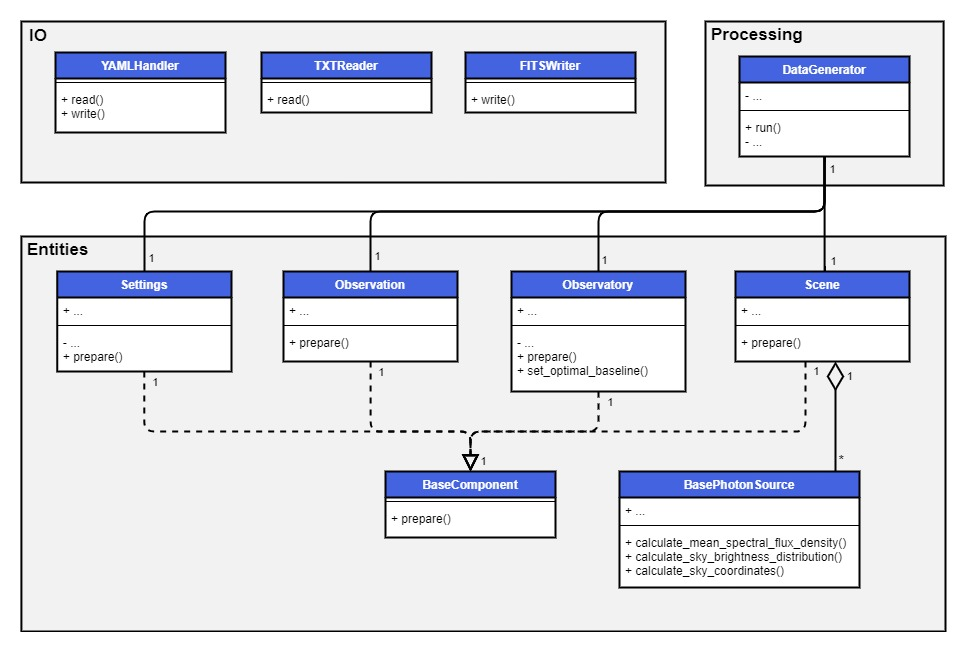

.. _architecture:

Architecture
============

A simplified UML diagram of the architecture of SYGN is shown below. The key elements are the four components
``Settings``, ``Observation``, ``Observatory`` and ``Scene``, whose properties are specified in the input files and the
``DataGenerator`` class, which uses the four components to generate the synthetic data.

