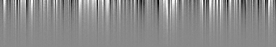

.. first_example:

First Example
=============

This first example demonstrates how to use PHRINGE from the command line to generate synthetic photometry data for an
Earth twin orbiting a Sun twin at 10 pc. Note that no spectrum file is provided for the planet and, thus, a blackbody
spectrum will be generated for it.

Download the Configuration File
--------------------------------

Open a terminal and enter the following command to download the configuration file:

.. code-block:: console

    wget -O config.yaml https://raw.githubusercontent.com/pahuber/PHRINGE/main/docs/_static/config.yaml

Download the Exoplanetary System File
----------------------------------

In the terminal, enter the following command to download the exoplanetary system file:

.. code-block:: console

    wget -O exoplanetary_system.yaml https://raw.githubusercontent.com/pahuber/PHRINGE/main/docs/_static/exoplanetary_system.yaml

Run PHRINGE
--------

To generate the synthetic data run the following command in the terminal:

.. code-block:: console

    phringe config.yaml exoplanetary_system.yaml

Output
------

This will create a directory called `out_{timestamp}` containing a FITS file with the synthetic photometry data and a
copy of the two input files. Opening the FITS file in a FITS viewer will reveal (due to the randomness involved)
something similar to the following image:

Here, the brightness corresponds to the photon counts, while the x-axis corresponds to time and the y-axis to wavelength
/spectral channel.