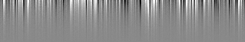

.. _index:

PHRINGE
====

**PHRINGE** is a synthetic **PH**\ otometry data gene\ **R**\ ator for null\ **ING** int\ **E**\ rferometers. It can
simulate the observation of an exoplanetary system with a space-based nulling interferometer and generate realistic data
in terms of photon counts as a function of wavelength and time, considering both astrophysical and instrumental
noise sources.

.. toctree::
   :maxdepth: 2
   :caption: Getting Started:
   :hidden:

   installation
   usage
   first_example

.. toctree::
   :maxdepth: 2
   :caption: User Documentation:
   :hidden:

   overview
   input_files
   api_documentation

.. toctree::
   :maxdepth: 2
   :caption: Developer Documentation:
   :hidden:

   architecture
