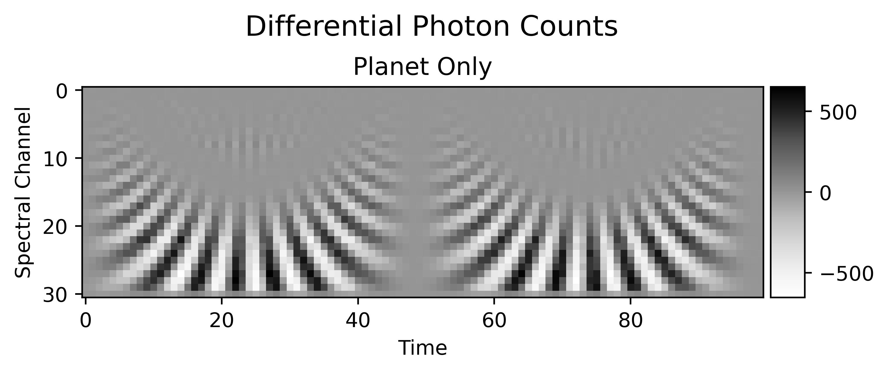
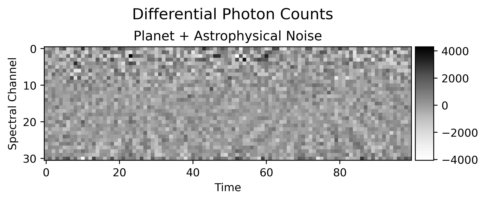
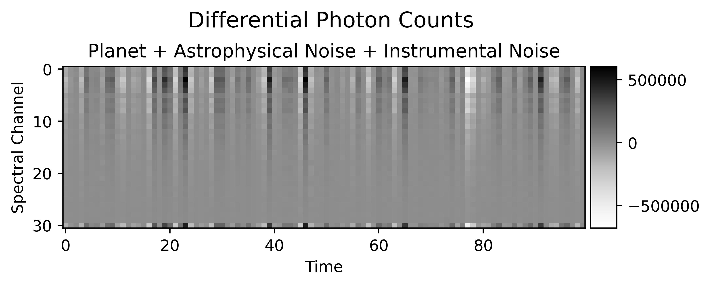

.. _index:

SYGN
====

SYGN is a **SY**\ nthetic photometry data **G**\ enerator for **N**\ ulling interferometers. It can simulate the
observation of an exoplanetary system with a space-based nulling interferometer and generate realistic photometry data
as a function of wavelength/spectral channel and time, considering both astrophysical and instrumental noise sources.

Key Features
------------

* **Interferometer Architecture**: Model different array configurations (Emma-X, equilateral triangle, regular pentagon) and beam combination schemes (double bracewell nulling, kernel nulling)
* **Noise Sources**: Model different noise sources, including
    * **Astrophysical Sources**: Stellar, local zodi and exozodi leakage
    * **Instrumental Sources**: Amplitude, phase (OPD) and polarization rotation perturbations
* **Exoplanetary Systems**: Model exoplanetary systems with single or multiple planets using blackbody or user-defined planetary spectra

.. toctree::
   :maxdepth: 2
   :caption: Getting Started:
   :hidden:

   installation
   usage
   first_example

.. toctree::
   :maxdepth: 2
   :caption: User Documentation:
   :hidden:

   configuration
   spectrum_context
