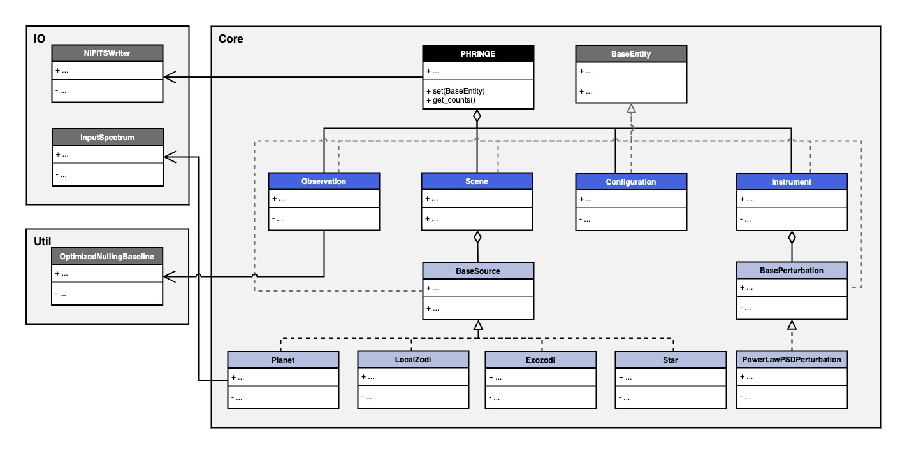

.. _overview:

Overview
========

Architecture
------------

The simplified class diagram of PHRINGE shown below gives an overview of the software architecture. The key components
are a **user interface (UI)**, a **processing** component, an **input/output (IO)** component and the **entities**.

Components
----------

UI
~~
The UI contains the `PHRINGE class, which serves as an interface to let the user configure the simulation and retrieve the results thereof.

Processing
~~~~~~~~~~
The processing component contains the ``Director`` and ``DataGenerator`` classes. The ``Director`` class is responsible for coordinating the simulation, i.e. preparing all objects needed by the ``DataGenerator`` and then running the latter.
This includes the following steps:

* Calculate the simulation time steps.
* Calculate the simulation wavelength bins.
* Calculate the field of view of the observatory.
* Calculate the nulling baseline.
* Calculate the instrument perturbation time series, if applicable.
* Calculate the array coordinates for all time steps.
* Calculate the spectral flux density, brightness distributions and coordinates of all sources in the scene.

The ``DataGenerator`` class is responsible for generating the photon count data. This includes the following steps:

* Calculate the complex amplitudes at the collectors.
* Calculate the intensity responses using the complex amplitudes and the beam combination transfer matrix.
* Calculate the photon counts using the intensity response and the sources in the scene.

IO
~~

The IO component contains the ``TXTReader``, ``FITSWriter`` and ``YAMLHandler`` classes to read text files, write FITS files and handle YAML files, respectively.

Entities
~~~~~~~~
The entities are the classes that represent the objects in the simulation. The main objects are the ``Settings``, ``Observation``, ``Observatory`` and ``Scene`` classes.