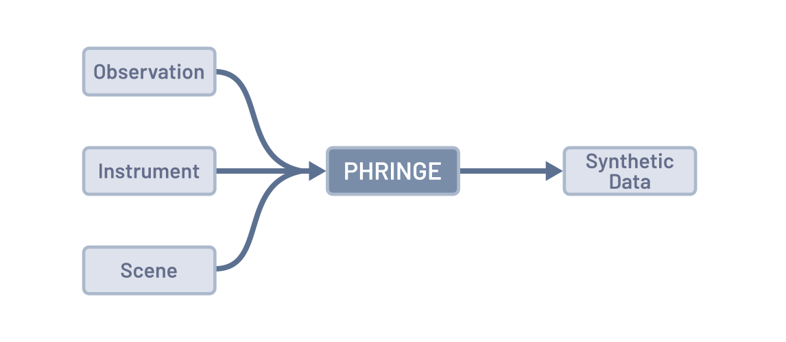

.. _usage:

Usage
=====
At the beginning of every simulation done with `PHRINGE` is the :doc:`PHRINGE <source/phringe>` class. Upon its initialization, the user
has to specify the observation, instrument and astrophysical scene parameters. This can be done in two ways:

#. | **Using Config Files (Recommended):**
   | Use a `config file <tutorials/first_example.rst>`_ together with a :doc:`Configuration <source/configuration>` object.
#. | **Manually Creating Objects (Advanced):**
   | Manually create the :doc:`Observation <source/observation>`, :doc:`Instrument <source/instrument>` and :doc:`Scene <source/scene>` objects.
   | This might be required for more advanced use cases such as looping through a parameter space.

Once these objects are set, the detector counts can be calculated. The following code snippet gives a quick overview of how to use `PHRINGE`:

.. code-block:: python

    # Create a PHRINGE object
    phringe = PHRINGE()

    # Option 1 (Recommended): Get objects from a config file
    config = Configuration(path="path/to/config.py")
    phringe.set(config)

    # Option 2: Create objects manually (Advanced)
    obs = Observation(...) # Arguments omitted here for brevity
    phringe.set(obs) # This will overwrite the the observation defined in the config file

    inst = Instrument(...) # Arguments omitted here for brevity
    phringe.set(inst) # This will overwrite the instrument defined in the config file

    scene = Scene(...) # Arguments omitted here for brevity
    phringe.set(scene) # This will overwrite the scene defined in the config file

    # Calculate counts
    counts = phringe.get_counts()

.. note::
    It is recommended to run `PHRINGE` on a GPU, as the simulation gets computationally expensive quickly and may take a substantial amount of time on CPUs.
